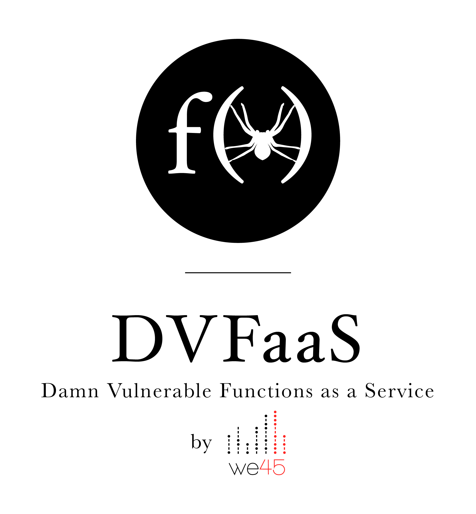

# DVFaaS - Damn Vulnerable Functions as a Service

> A DHIY (Deploy and Hack It Yourself) Project that you can deploy and run a bunch of 'orribly insecure functions on AWS Lambda

### Objective and Audiences

* We at we45 do a lot of training around Serverless Security, Cloud and security of modern web stacks.
* We strongly believe that there's a great need for developers, architects, DevOps and Security Personnel to learn and understand about the risks with these modern components
* This project is a culmination of our training efforts in developing intentionally vulnerable Serverless apps (FaaS) that we have decided to open out to the community at large

This project is great for you, if:
* You want to learn about security flaws with serverless apps, specifically FaaS implementations.

This project is not for you, if:
* You don't want to deploy (and run) your own functions. The idea here is for you to learn by doing.

#### Please note:
* The functions are targeted to be deployed in AWS Lambda. But the principles and concepts apply across the board
* Most of the functions are in Python, specifically in a framework called `chalice` (meant for python on AWS Lambda). Deployment of these functions to your lambda environment is reasonably simple
* Ultimately the project maps to the OWASP Serverless Top 10, found [here](https://www.owasp.org/index.php/OWASP_Serverless_Top_10_Project), but some examples may vary
* The ops (deployment) for this project is largely done with Terraform. Please find docs [here](https://www.terraform.io/docs/providers/aws/)
* Each example has a README, which has installation instructions, etc. In many cases, the deployment for multiple examples ove

### Requirements
#### Code
* Python 3.6
* Pipenv (dependency management)
* Chalice
* PyYAML
* HTTPie
* AWS CLI with root or high privileges required for deployment/setup of various AWS components
* jq

#### AWS Resources
* RDS => MySQL (Free Tier eligible)
* DynamoDB (Free Tier Eligible)
* Amazon SNS (Pub/Sub for Topics)
* Amazon Lambda, y'know....for functions
* Amazon Cloudwatch Logs

## Disclaimer
**Please use in personal/non-production accounts only**
We do not take responsibility for the way in which any one uses these functions (DVFaaS). We have made the purposes of the application clear and it should not be used maliciously. We have given warnings and taken measures to prevent users from installing DVFaaS on to production accounts.
You are responsible for requisite authorizations (if any) that you will need to run this on your AWS account.

## Installation and Setup
* Git clone the project `git clone <URL>`
* We are using pipenv to manage dependencies for the project. You can use `pipenv install` to install all deps
* Each lab has its own deployment specification. In most cases, there's a specific deployment directory in each lab called `ops`
which is used to manage deployments
* We highly recommend using `httpie` as the http client as its command line and really easy to use
* For some deployments, we are using Terraform to perform deployments and setup AWS IAM Roles and so on.
    * Please note that you'll need to have high/root privileges on AWS with aws cli for all this to work.
* Currently, for all exercises we are using Chalice (a AWS Lambda framework in Python).
    * All labs have a `.chalice` folder that is recognized by chalice for the purposes of deployment.
    * For most of the labs, you'll have to configure the `.chalice/config.json` file to configure the deployment. Please read each lab's README for this info.
    This will have to be done, post deployment (which is the `ops` directories where applicable)
    * Once done, deployment is reasonably easy to do, with a simple `chalice deploy` command which will push your Lambda function to your AWS account:
        * Please note that you'll need to have high/root privileges on AWS with aws cli for all this to work.

## TODO
* Video series explaining deployment and execution of attacks
* GraphQL Examples
* NodeJS Examples