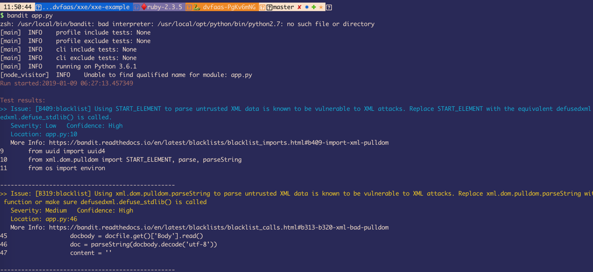
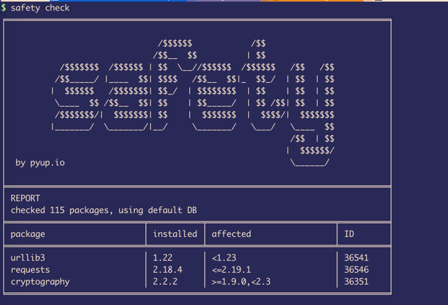

## Static Analysis for Serverless Functions

While DAST/IAST for Serverless functions is still not as good as we'd like it to be. Static Analysis is still a very valid and viable option
to identify security issues with your functions

In this lab, we'll be using Bandit to perform Static Analysis against our functions. [Bandit](https://github.com/PyCQA/bandit) is a great open-source SAST tool for Python.
If you've run `pipenv install` as mentioned in the Project's README, then you'd have bandit installed

## Run
* cd into the directory of any of the labs with an `app.py` in it.
* run `bandit app.py` to run a static analysis against the module
* Observe the vulnerabilities that the static analysis tool identifies

## Source Composition Analysis - Serverless Functions

Source Composition is exceedingly important with serverless functions, as vulnerabilities in dependencies can easily mean, vulnerabilities in the deployed functions or applications.
In this lab, we will use the `PyUP Safety` to identify vulnerabilities in the dependencies that we are using.

If you've run `pipenv install` as mentioned in the Project's README, then you'd have `safety` installed

## Run
* Run this anywhere in the project's virtualenv: `safety check`

